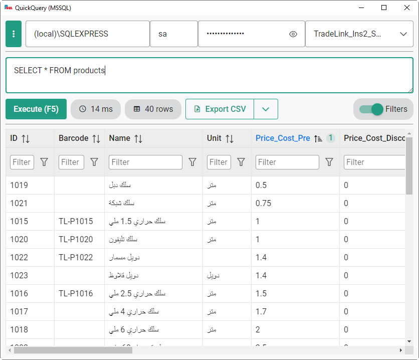

# QuickQuery

[](https://github.com/mmghv/QuickQuery/actions/workflows/build.yml)

A simple SQL database query tool, built using [Wails](https://wails.io/) (Go & Vue.js)

Currently only supports `MSSQL`, other SQL databases will be supported in the future.



## Download

Download the latest version from the [releases page](https://github.com/mmghv/QuickQuery/releases), it's a standalone executable that doesn't need installation.

Currently only built for `Windows`, if there's a request for `Linux` or `MacOS` I may setup a workflow to build for it. Alternatively, you can use the instructions provided in the following section to build it yourself from the source code on your system. 

## Build locally

1- Follow [these instructions](https://wails.io/docs/gettingstarted/installation) to install `Wails` and its dependencies (Go & NPM + Node)

2- Clone this repo :

```
git clone https://github.com/mmghv/QuickQuery.git
```

3- Run the build command in the project directory

```
wails build
```

You can find all build options [here](https://wails.io/docs/reference/cli#build).

## TODO

- [ ] Build for other platforms.
- [ ] Add support for `MySQL` and `SQLite`.
- [ ] Add connection sessions feature.
- [ ] Add multiple query tabs feature.
- [ ] Add `Export to excel` feature.
- [ ] Add `Dark Mode` feature.

## Credits

App icon by [Mohamed Elsayed](https://www.behance.net/mohamedzzz).

## License

Copyright © 2023 [Mohamed Gharib](https://github.com/mmghv), Released under the [MIT license](LICENSE).